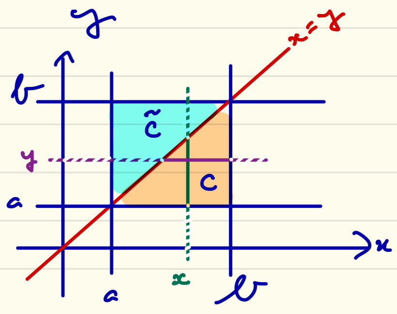

## M1 MPA
# Analyse de Fourier et distributions
# 2023-24

# Exam CC no. 1

**Durée 2H. Documents non autorisés.**

## Exercice 1 (5 points)
Pour chacune des expressions ci-dessous (où $n \geq 1$) dire si la limite quand $n \to \infty$ existe et, le cas échéant, déterminer cette limite.

### 1.1
$$ \int_1^\infty x^n e^{-x}\ \mathrm{d}x $$

**Réponse.** En posant $f_n(x) := x^n e^{-x}$, on définit une suite croissante (remarquer que $x \geq 1$, donc que $x^n \leq x^{n+1}$) de fonctions positives : le théorème de convergence monotone s'applique. Clairement, pour $x > 1$, on a $f_n(x) \to \infty$ quand $n \to \infty$, de sorte que la limite de la suite d'intégrales existe et vaut $\infty$.

### 1.2
$$ \int_0^n \frac{1-\cos(x/n)}{1+x^4}\ \mathrm{d}x $$

**Réponse.** En posant

$$ f_n(x) := \frac{1-\cos(x/n)}{1+x^4} \chi_{[0,n]}(x) $$

on définit une suite de fonctions intégrables sur $\mathbf{R}_+$ qui converge simplement vers $0$ et sont toutes dominées par la fonction intégrable $2/(1+x^4)$. D'où l'existence de la limite, nulle, par convergence dominée.

### 1.3
$$ \int_0^n (1-x/n)^{n^2}\cos(nx)\ \mathrm{d}x $$

**Réponse.** En posant $f_n(x) := (1-x/n)^{n^2}\cos(nx)\chi_{[0,n]}(x)$, on définit une suite de fonctions intégrables sur $\mathbf{R}+$ qui converge simplement vers $0$ en tout $x > 0$ puisque  $(1-x/n)^{n^2} = e^{n^2\ln(1-x/n)}$ qui tend (équivalent puis composition de limites) vers $\lim_{y \to \infty} e^{-y}=0$. D'où l'existence de la limite, nulle, par convergence dominée puisque, pour tout réel $x$ on a $1-x \leq e^{-x}$ (convexité), de sorte que $0 \leq (1-x/n)^n \leq e^{-x}$ si $x \in [0,n]$ et

$$ |(1-x/n)^{n^2}\cos(nx)\chi_{[0,n]}(x)| \leq e^{-nx} \leq e^{-x},\quad x \geq 0,\quad n \geq 1. $$

## Exercice 2 (5 points)

### 2.1
Montrer que la fonction

$$ F(t) := \int_\mathbf{R} e^{-|x|}\cos(tx)\ \mathrm{d}x $$

est bien définie pour tout réel $t$.

**Réponse.** Pour $t$ un réel fixé, la valeur absolue de l'intégrande est une fonction paire dominée en valeur absolue sur $\mathbf{R}_+$ par $e^{-x}$, intégrable. D'où l'intégrabilité.

### 2.2
Soit $t_0 \in \mathbf{R}$, montrer que $F$ est continue en $t_0$.

**Réponse.** La majoration précédente, uniforme en $t$ (et valable sur tout $\mathbf{R}$, voisinage de $t_0$ !), associée à la continuité en $t$ de l'intégrande, montre la continuité en $t_0$ de l'intégrale paramétrée.

### 2.3
Calculer $F(t)$ pour tout $t \in \mathbf{R}$.

**Réponse.** Par parité, on se ramène à calculer

$$ \begin{eqnarray*}
  2\text{Re}( \int_0^\infty e^{-x+itx}\ \mathrm{d}x )
  &=& 2\text{Re} \left[ \frac{e^{(it-1)x}}{it-1} \right]_0^\infty
  &=& \frac{2}{1+t^2} \cdot
\end{eqnarray*} $$

### 2.4
Montrer que $F$ est dérivable sur $\mathbf{R}$ et déduire de ce qui précède la valeur de

$$ \int_\mathbf{R} xe^{-|x|}\sin(x)\ \mathrm{d}x. $$

**Réponse.** La dérivée partielle de l'intégrande existe et vaut $-xe^{-|x|}\sin(tx)$, fonction paire dont la valeur absolue est dominée  sur $\mathbf{R}_+$ par $xe^{-x}$, intégrable (cette majoration est à nouveau valable sur $\mathbf{R}$, voisinage de $t_0$). On confirme ainsi la dérivabilité de l'intégrale paramétrée en $t_0$, et 

$$ F'(t_0) =-\int_\mathbf{R} xe^{-|x|}\sin(t_0 x)\ \mathrm{d}x. $$

En particulier, en faisant $t_0=1$ et en utilisant la question  précédente,

$$ \int_\mathbf{R} xe^{-|x|}\sin(x)\ \mathrm{d}x = -F'(1)
= - \left( \frac{2}{1+t^2} \right)'_{|t=1} = 1. $$

## Exercice 3 (4 points)
Soient $a$ et $b$ deux réels, $a < b$. Soit $f \in L^1([a,b]^2)$.

### 3.1
Montrer que les deux intégrales ci-dessous sont bien définies et égales : 

$$ \int_a^b \left( \int_a^x f(x,y)\ \mathrm{d}y \right)\ \mathrm{d}x
 = \int_a^b \left( \int_y^b f(x,y)\ \mathrm{d}x \right)\ \mathrm{d}y =: I. $$
 
 **Réponse.**  L'égalité résulte de l'application du théorème de Fubini au calcul de l'intégrale de $f$ sur

$$ C := \lbrace (x,y) \in [a,b]^2\ |\ x \geq y \rbrace. $$

### 3.2
On suppose de plus que, presque pour tout $(x,y) \in [a,b]^2$, on a $f(y,x)=f(x,y)$. Montrer que

$$ I = \frac{1}{2} \int_{[a,b]^2} f(x,y)\ \mathrm{d}x\mathrm{d}y. $$

**Réponse.** Soit

$$ \widetilde{C} := \lbrace (x,y) \in [a,b]^2\ |\ y \geq x \rbrace $$

le symétrique de $C$ par rapport à la droite $y=x$. On a

$$ \int_{[a,b]^2} f(x,y)\ \mathrm{d}x\mathrm{d}y = \int_C f(x,y)\ \mathrm{d}x\mathrm{d}y + \int_{\widetilde{C}} f(x,y)\ \mathrm{d}x\mathrm{d}y, $$

et

$$ \int_{\widetilde{C}} f(x,y)\ \mathrm{d}x\mathrm{d}y = \int_C f(v,u)\ \mathrm{d}u\mathrm{d}v, $$

cette dernière égalité (claire géométriquement) s'obtenant en considérant le changement de variable $(x,y) = (v,u) = \varphi(u,v)$, $\varphi : C \to \widetilde{C}$ (noter que $|\det\varphi'(u,v)| = 1$). On en déduit l'égalité voulue quand $f$ est symétrique.

## Exercice 4 (6 points)
On rappelle que $c_0$ est l'espace de suites réelles convergeant vers zéro. 

### 4.1
Soit $(u_n)_n$ une suite de $\ell^1$ (espace des suites réelles sommables), montrer que l'application de $c_0$ dans $\mathbf{R}$

$$ (v_n)_n \mapsto \sum_n u_n v_n $$

définit une forme linéaire continue sur $c_0$.

**Réponse.** Une suite $c_0$ est bornée, et on peut appliquer Hölder pour majorer,

$$ \sum_n |u_n v_n| \leq \|\| u \|\|\_1 \|\| v \|\|_\infty < \infty, $$

ce qui montre la convergence absolue (normale) de cette série de réels, donc sa convergence. Par linéarité et par continuité du produit par un scalaire et de la somme de deux scalaires, on vérifie que

$$ \sum_n u_n (\lambda v_n + w_n) = \lambda \sum_n u_n v_n + \sum_n u_n w_n, $$

d'où la linéarité. La majoration précédente montre la continuité de cette application linéaire puisque, pour toute suite $(v_n)\_n$ de $(c_0,\|\| \cdot \|\|_\infty)$,

$$ |\sum_n u_n v_n| \leq \|\| u \|\|\_1 \|\| v \|\|_\infty. $$

On en déduit également que la norme de cette application linéaire continue est majorée par $\|\| u \|\|_1$.

### 4.2
On considère l'application $\Theta$ de $\ell^1$ dans $(c_0)'$, le dual topologique de $c_0$, qui à $(u_n)_n$ dans $\ell^1$ associe la forme linéaire continue précédemment définie : 

$$ \Theta((u_n)_n) \cdot (v_n)_n := \sum_n u_n v_n. $$

Montrer que $\Theta$ est linéaire continue, et majorer sa norme en tant qu'application linéaire continue.

**Réponse.** Le même argument de linéarité et de continuité qu'à la question précédente permet d'affirmer que, pour $(u_n)_n$ et $(w_n)_n$ dans $\ell^1$ et $(v_n)_n$ dans $c_0$,

$$ \sum_n (\lambda u_n + w_n) v_n =  \lambda \sum_n u_n v_n + \sum_n w_n v_n. $$

L'application $\Theta$ étant donc linéaire, la majoration obtenue à la question précédente montre la continuité ; on en déduit que

$$ \|\| \Theta \|\|_{\mathscr{L}(\ell^1,(c_0)')} \leq 1. $$

### 4.3
Montrer que $\Theta$ est injective.

**Réponse.** L'application étant linéaire, il suffit de montrer que son noyau est trivial. Or, si $\Theta \cdot (u_n)_n = 0$, pour tout $m \in \mathbf{N}$ on a

$$ 0 = \langle \Theta \cdot (u_n)_n,e^m \rangle = u_m $$

en prenant $e^m := (\delta_{m,n})_n$ (suite partout nulle sauf au rang $m$). 

### 4.4
Montrer que $\Theta$ est surjective.

**Réponse.** Soit $\varphi \in (c_0)'$ ; s'il existe $(u_n)_n$ dans $\ell^1$ telle que $\Theta \cdot (u_n)_n = \varphi$, nécessairement, pour tout $m \in \mathbf{N}$,

$$ u_m = \langle \Theta \cdot (u_n)_n,e^m \rangle = \langle \varphi,e^m \rangle. $$

Posons donc $(u_n)_n := (\langle \varphi,e^n \rangle)_n$. Cette suite est dans $\ell^1$ puisque, si $N \in \mathbf{N}$,

$$ \sum_{n=0}^N |u_n| = \sum_{n=0}^N \langle \varphi,\varepsilon_n e^n \rangle,\quad \varepsilon_n := \text{signe}(u_n), $$

de sorte que

$$ \sum_{n=0}^N |u_n|  \leq \|\| \varphi \|\|\_{(c_0)'} \cdot  \underbrace{\|\| \sum_{n=0}^N \varepsilon_n e^n \|\|\_\infty}\_{=1} = \|\| \varphi \|\|_{(c_0)'} < \infty. $$

Soit finalement $(v_n)_n$ dans $c_0$, comme $\sum_{n=0}^N v_n e^n$ converge vers $(v_n)_n$, par linéarité et continuité de $\varphi$ on a

$$ \langle \varphi,(v_n)\_n \rangle = \lim_{N \to \infty} \sum_{n=0}^N v_n \langle \varphi,e^n \rangle = \sum_n u_n v_n = \langle \Theta \cdot (u_n)_n,(v_n)_n \rangle, $$

d'où la surjectivité. 

### 4.5
Montrer que $\Theta$ est un isomorphisme isométrique.

**Réponse.** La suite $(u_n)_n$ de $\ell^1$ déterminée à la question précédente vérifie $\|(u_n)_n\|_1 \leq \|\varphi\|_{(c_0)'}$ ; ça montre la continuité de la réciproque $\Theta^{-1}$, linéaire,[^1] et on a

$$ \|\| (u_n)\_n \|\|\_1 \leq \|\| \Theta \cdot (u_n)\_n \|\|_{(c_0)'} \leq \|\| (u_n)_n \|\|_1 $$

au vu du 4.1, d'où le caractère isométrique de l'isomorphisme.

### 4.6
Que peut-on en déduire sur $\ell^\infty$ (espace des suites réelles bornées) ?

**Réponse.** Ce qui précède montre que $(c_0)' \simeq \ell^1$, donc que $(c_0)'' \simeq \ell^\infty \supsetneq c_0$ : $c_0$ n'est donc pas réflexif, donc son dual $\ell^1$ non plus,[^2] donc $\ell^\infty$ non plus.

[^1]: Une bijection linéaire continue entre espaces de Banach est nécessairement ouverte (th. application ouverte), donc d'inverse continu.

[^2]: Un espace vectoriel normé est réflexif si et seulement si son dual l'est.
